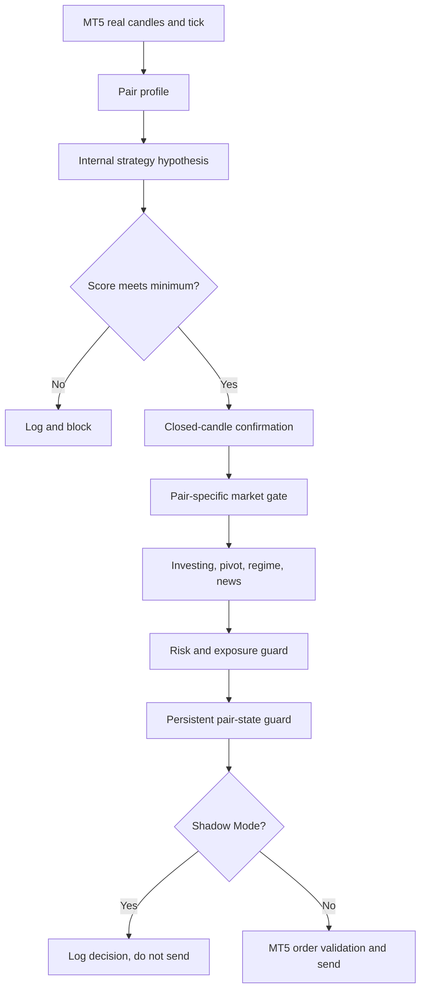

# XAU-PY Trading Dashboard

[](#run-the-app)
[](#dashboard-pages)
[](#mt5-setup)
[](#verification)
[](#safety-first)

Local trading control center for `XAUUSD` and `EURUSD`, built with FastAPI, React, and MetaTrader 5 integration.

The application combines strategy signals, pair-specific market gates, account risk, aggregate exposure, Investing.com confirmation, persistent trade state, trailing, hard TP, recovery controls, and decision logging in one dashboard.

> [!CAUTION]
> This software does not guarantee profit. Keep Shadow Mode enabled until account exposure, pair state, data sources, and Parameter Check are ready.

## Navigation

- [Start the app](#run-the-app)
- [Open the dashboard](http://127.0.0.1:5174)
- [Check backend health](http://127.0.0.1:9000/api/backend/health)
- [Check EA connection](http://127.0.0.1:9000/api/ea/status)
- [Understand the strategy](#how-an-order-is-decided)
- [Review pair profiles](#pair-profiles)
- [Review safety controls](#safety-first)
- [Explore API endpoints](#api-map)
- [Troubleshoot startup](#troubleshooting)

## System Snapshot

| Component | Current design |
| --- | --- |
| Backend | FastAPI on `127.0.0.1:9000` |
| Frontend | React dashboard on `127.0.0.1:5174` |
| Trading terminal | MetaTrader 5 / Exness |
| Pair profiles | `XAUUSD`, `EURUSD` |
| Removed pair | `GBPUSD` |
| Execution timeframes | `M15`, `M30`, `H1` |
| Context timeframes | `H4`, `D1` |
| Account modes | Standard `USD` or cent `USC` |
| USC conversion | `100 USC = 1 USD` |
| Global risk cap | Configurable, default `20%` |
| Maximum lot | `0.10` per position |
| Investing sync | Automatic every `60 seconds` |
| Configuration | Pair-aware config version `2` |
| Migration behavior | Backup settings and enable Shadow Mode |

## Dashboard Pages

| Page | What it answers |
| --- | --- |
| **Summary** | What is the account P/L, open exposure, trade count, and current operating state? |
| **Strategy System** | Which strategy, risk, market-data, pair-state, and signal parameters currently pass or block? |
| **Settings** | Which pairs and protections are enabled, and what are their exact limits? |
| **Investing** | What technical, timeframe, moving-average, indicator, and Fibonacci pivot data was synchronized? |

### Parameter Check

The **Strategy System** page is the operational source of truth. It displays live values against expected limits:

```text
PASS     Parameter is available and inside its limit
WARNING  Parameter needs attention or is intentionally transitional
BLOCKED  New execution must not continue
OFF      Feature is intentionally disabled
INFO     Informational value without a hard gate
```

It includes:

- Backend and MT5 readiness.
- Config version, account mode, Full Auto, and Shadow Mode.
- Global and pair-level risk.
- XAUUSD aggregate SL exposure.
- EURUSD strict gate parameters.
- Pair lock, cooldown, and close-only state.
- Hard TP, trailing, and recovery status.
- Investing.com and economic-calendar readiness.
- Confluence scores for every timeframe.
- Potential signal logger and detailed decision audit.

## Run The App

### Fastest Start

```powershell
.\launch-app.ps1
```

The launcher:

1. Checks dependencies and ports.
2. Starts the backend on `9000`.
3. Starts the frontend on `5174`.
4. Enables the demo guard.
5. Checks MT5 connectivity.
6. Opens the dashboard.

### First Installation

```powershell
npm install
python -m venv .venv
.\.venv\Scripts\python.exe -m pip install -r requirements.txt
```

Install `MetaTrader5` manually in a compatible Python environment when MT5 is available:

```powershell
.\.venv\Scripts\python.exe -m pip install MetaTrader5
```

### Start Services Separately

Backend:

```powershell
.\.venv\Scripts\python.exe -m uvicorn backend.app.main:app --host 127.0.0.1 --port 9000
```

Frontend development server:

```powershell
npm run dev -- --port 5174
```

Open [http://127.0.0.1:5174](http://127.0.0.1:5174).

## How An Order Is Decided



An order is eligible only when all required layers agree:

```text
Pair enabled
+ execution timeframe
+ real MT5 data
+ sufficient confluence
+ completed candle confirmation
+ pair market gate
+ spread and RR validation
+ account risk capacity
+ pair exposure capacity
+ no active lock or cooldown
= eligible order
```

## Pair Profiles

### XAUUSD

XAUUSD preserves the existing multi-position strategy while adding shared safety.

| Parameter | Default |
| --- | --- |
| Investing mode | Advisory |
| Market Fact Gate | Advisory |
| Maximum open positions | `5` |
| Maximum pending orders | `2` |
| Maximum total lot | `0.50` |
| Maximum lot per order | `0.10` |
| Aggregate SL cap | `15%` of `min(balance, equity)` |
| Recovery | Configurable |
| Pivot | Advisory unless explicitly required |

Aggregate risk includes:

```text
open positions with SL
+ active pending orders with SL
+ candidate order risk
= projected aggregate SL risk
```

An open or pending order without a valid SL blocks new exposure.

### EURUSD

EURUSD uses a fail-closed execution profile.

| Parameter | Default |
| --- | --- |
| Investing mode | Required |
| Market Fact Gate | Strict |
| Pivot | Required |
| MT5 real data | Required |
| Risk per trade | `0.25%` |
| Maximum lot | `0.05` |
| Maximum positions | `1` |
| Maximum pending orders | `0` |
| Minimum RR | `1.5` |
| SL clamp | `10-30` pips |
| TP model | `1.6R` |
| Cooldown after SL | `30 minutes` |
| Loss-streak lock | `2` consecutive SL |
| Daily loss limit | `1%` |
| Recovery | Disabled |
| News filter | Enabled |

## Safety First

### Shadow Mode

Shadow Mode performs strategy, gate, risk, and exposure checks but does not send an order.

During migration:

- Existing positions remain managed by hard TP and trailing.
- New entries and recovery layers are not sent.
- Existing aggregate-cap breaches are displayed as transition warnings.
- Shadow Mode does not persist automatic `CLOSE_ONLY` solely because legacy positions exceed the new aggregate cap.
- Explicit pair close-only settings and existing persisted locks remain authoritative.

### Hard TP And Trailing

- Hard TP is configurable per pair in USD-equivalent value.
- Hard TP has priority outside an active recovery basket.
- The monitor checks positions every second.
- EURUSD uses pip-based break-even and trailing.
- XAUUSD retains its gold-specific trailing behavior.

### Recovery

Recovery is bounded by:

- Pair profile enablement.
- Maximum recovery layers.
- Lot cap.
- Pair exposure cap.
- Global risk cap.
- Persistent close-only state.
- Shadow Mode.
- MT5 readiness and demo guard.

EURUSD recovery is disabled by default.

### Live Readiness Checklist

Before turning Shadow Mode off:

- [ ] Backend is active on port `9000`.
- [ ] MT5 is connected and Algo Trading is enabled.
- [ ] Demo guard matches the intended account.
- [ ] Strategy System has no unexplained `BLOCKED` parameter.
- [ ] Pair state storage is healthy.
- [ ] Investing data is fresh for every required pair.
- [ ] Economic-calendar data is available for strict EURUSD execution.
- [ ] Open positions and total lot are inside pair limits.
- [ ] XAUUSD projected aggregate SL risk is inside its configured cap.
- [ ] No position or pending order is missing SL.
- [ ] Hard TP, trailing, and recovery parameters have been reviewed.
- [ ] Settings backup exists before changing live behavior.

## Investing.com Data

| App timeframe | Investing timeframe | Role |
| --- | --- | --- |
| `M15` | `15m` | Execution confirmation |
| `M30` | `30m` | Execution confirmation |
| `H1` | `1h` | Execution confirmation and directional context |
| `H4` | `5h` | Monitoring context |
| `D1` | `1d` | Higher-timeframe context |

The sync stores:

- Technical summary.
- Timeframe signals.
- Moving averages.
- Technical indicators.
- Fibonacci levels `S3` through `R3`.
- Parser, cache, retry, and strategy-use status.

For EURUSD, unavailable or stale required data blocks automatic execution. For XAUUSD, Investing is advisory by default.

## Account Modes

Select the account type in **Settings**:

| Mode | Conversion |
| --- | --- |
| Standard USD | `1 account unit = 1 USD` |
| USC Cent | `100 USC = 1 USD` |

The selected mode affects:

- Balance and equity normalization.
- P/L display.
- Hard TP.
- Hedge and basket targets.
- Floating-loss comparisons.
- Aggregate risk calculations.
- Minimum-balance recommendations.

The minimum-balance calculator uses current execution-timeframe stop distances, `0.01` lot, the per-position risk guard, and a `25%` operating reserve. It is a capacity estimate, not a profitability forecast.

## API Map

<details>
<summary><strong>Health and services</strong></summary>

| Method | Endpoint | Purpose |
| --- | --- | --- |
| `GET` | `/api/status` | MT5 account and execution readiness |
| `GET` | `/api/ea/status` | Compact EA/backend status |
| `GET` | `/api/backend/health` | Backend PID and uptime |
| `POST` | `/api/backend/restart` | Restart backend |
| `POST` | `/api/services/restart-all` | Restore backend and frontend services |
| `POST` | `/api/demo-guard` | Enable or disable live-account protection |

</details>

<details>
<summary><strong>Strategy, risk, and execution</strong></summary>

| Method | Endpoint | Purpose |
| --- | --- | --- |
| `GET` | `/api/auto-mode/status` | Config, minimum balance, risk, and exposure |
| `POST` | `/api/auto-mode` | Save strategy and risk settings |
| `POST` | `/api/auto-mode/scan-now` | Run immediate strategy scan |
| `GET` | `/api/signals` | Build one signal |
| `POST` | `/api/signals/scan` | Scan configured signals |
| `POST` | `/api/orders/validate` | Validate an order without sending |
| `POST` | `/api/orders/execute` | Submit a confirmed order |
| `GET` | `/api/pair-exposure` | Pair-level positions, lots, and aggregate SL risk |
| `GET` | `/api/pair-state` | Persistent cooldown, lock, and close-only state |

</details>

<details>
<summary><strong>Position management</strong></summary>

| Method | Endpoint | Purpose |
| --- | --- | --- |
| `GET` | `/api/positions` | Current MT5 positions |
| `GET` | `/api/positions/alerts` | Position validity alerts |
| `POST` | `/api/positions/close` | Close one group or all positions |
| `POST` | `/api/positions/trailing-stop` | Update a position trailing stop |
| `GET` | `/api/auto-trailing/status` | Hard TP and trailing monitor status |
| `GET` | `/api/recovery/status` | Recovery phase and basket P/L |
| `POST` | `/api/recovery/scan-now` | Run immediate recovery evaluation |

</details>

<details>
<summary><strong>Market data and logs</strong></summary>

| Method | Endpoint | Purpose |
| --- | --- | --- |
| `GET` | `/api/market/ticks` | Current pair ticks |
| `GET` | `/api/market/snapshot` | Candles, indicators, and zones |
| `GET` | `/api/investing/status` | Investing sync health |
| `GET` | `/api/investing/technical` | Technical and Fibonacci data |
| `POST` | `/api/investing/sync` | Trigger manual sync |
| `GET` | `/api/economic-calendar` | High-impact event data |
| `GET` | `/api/signal-log` | Potential signal dataset |
| `GET` | `/api/signal-audit` | Pair-gate decision audit |
| `GET` | `/api/journal` | Closed-trade journal |
| `POST` | `/api/data/reset` | Reset dashboard reporting baseline |

</details>

## Runtime Data

Runtime state is intentionally excluded from Git:

```text
data/investing_*.json
data/reset_state.json
data/strategy_settings.json
data/settings.backup-before-v2.json
data/migration-v2.log
data/recovery_state.json
data/pair_state.json
data/potential_signals.jsonl
data/signal_audit.jsonl
data/post_trade_review.jsonl
```

These files contain live cache, configuration, account state, or generated trading records.

## Verification

Run backend tests:

```powershell
.\.venv\Scripts\python.exe -m pytest backend/tests -q
```

Build the frontend:

```powershell
npm run build
```

Check active ports:

```powershell
Get-NetTCPConnection -LocalPort 9000,5174 -State Listen
```

Expected baseline:

```text
backend tests: 40 passing
frontend build: passing
backend: http://127.0.0.1:9000
frontend: http://127.0.0.1:5174
```

## Troubleshooting

<details>
<summary><strong>The app does not work after Windows starts</strong></summary>

Run:

```powershell
.\launch-app.ps1
```

Or use **Restart all services** from the dashboard when the backend is reachable.

Check ports:

```powershell
Get-NetTCPConnection -LocalPort 9000,5174 -State Listen
```

</details>

<details>
<summary><strong>Backend is online but a new endpoint returns 404</strong></summary>

An older backend process may still be serving stale code. Restart the backend:

```powershell
Invoke-RestMethod -Method Post http://127.0.0.1:9000/api/backend/restart
```

Then verify:

```powershell
Invoke-RestMethod http://127.0.0.1:9000/api/backend/health
```

</details>

<details>
<summary><strong>MT5 is connected but orders are blocked</strong></summary>

Check:

1. Algo Trading is enabled in MT5.
2. Account trading permission is enabled.
3. Demo guard is not blocking the current account.
4. Shadow Mode status.
5. Pair profile enablement.
6. Spread, score, RR, exposure, cooldown, and news status on **Strategy System**.

</details>

<details>
<summary><strong>Investing.com is blocking EURUSD</strong></summary>

Run a manual synchronization:

```powershell
Invoke-RestMethod -Method Post http://127.0.0.1:9000/api/investing/sync
```

Then inspect:

```powershell
Invoke-RestMethod http://127.0.0.1:9000/api/investing/status
```

EURUSD intentionally fails closed when required data cannot be trusted.

</details>

## Documentation

| Document | Purpose |
| --- | --- |
| [Feature catalog](docs/FEATURES.md) | Complete feature inventory |
| [Strategy and risk guide](docs/STRATEGY_AND_RISK.md) | Strategy, trailing, risk, and recovery behavior |
| [Decision guide](docs/APP_DECISION_GUIDE.md) | Operational decision rules |
| [Change log](docs/CHANGELOG.md) | Implementation history |

## Repository

[FiyyaLisanaDeV/XAU-PY](https://github.com/FiyyaLisanaDeV/XAU-PY)
