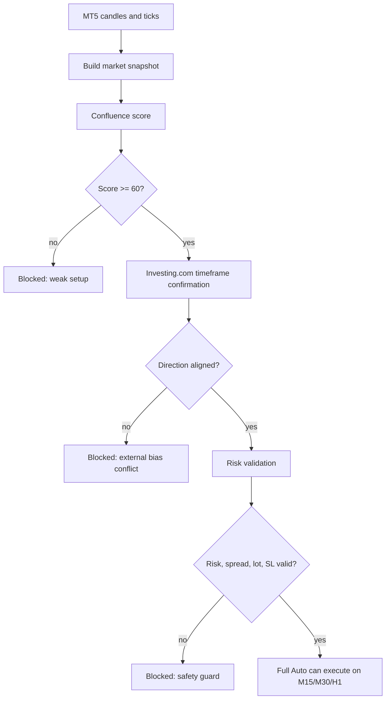

# XAU-PY Trading Dashboard

Local FastAPI + React dashboard for `XAUUSD` and `EURUSD` trading workflow with MT5 integration, Full Auto controls, risk guard, Investing.com confirmation, account summary, and execution monitoring.

> This app is built as a local trading assistant. It does not guarantee profit. Every automated decision is still constrained by MT5 status, demo guard, spread, stop loss, total risk cap, lot cap, and Investing.com confirmation.

## Quick Links

| Area | File |
| --- | --- |
| Feature catalog | [docs/FEATURES.md](docs/FEATURES.md) |
| Strategy and risk guide | [docs/STRATEGY_AND_RISK.md](docs/STRATEGY_AND_RISK.md) |
| Decision guide | [docs/APP_DECISION_GUIDE.md](docs/APP_DECISION_GUIDE.md) |
| Change log | [docs/CHANGELOG.md](docs/CHANGELOG.md) |

## Current Defaults

| Setting | Value |
| --- | --- |
| Backend | `http://127.0.0.1:9000` |
| Frontend | `http://127.0.0.1:5174` |
| Active pairs | `XAUUSD`, `EURUSD` |
| Removed pair | `GBPUSD` |
| Execution timeframes | `M15`, `M30`, `H1` |
| Monitor-only timeframes | `H4`, `D1` |
| Minimum confluence score | `60` |
| Total risk cap | `20%` equity |
| Max lot per position | `0.10` |
| Hard TP | configurable per pair, default `XAUUSD $10` and `EURUSD $10` |
| Hedge recovery | configurable, default `OFF` |
| Recovery layers | maximum `2`, multiplier maximum `1.50x` |
| Investing auto sync | every `60 seconds` |
| Restart all services | frontend button starts `5174` if needed and restarts backend `9000` |

## How The System Decides



Short version:

1. MT5 data creates the trade idea.
2. Confluence score decides if the setup is technically worth considering.
3. Investing.com confirms the direction by timeframe.
4. Risk engine decides if the trade is allowed.
5. Full Auto executes only if every guard passes.

## Investing.com Timeframe Map

The app stores Investing.com timeframe signals and maps them to internal strategy timeframes:

| App timeframe | Investing timeframe | Use |
| --- | --- | --- |
| `M15` | `15m` | execution confirmation, often locked by Investing |
| `M30` | `30m` | execution confirmation |
| `H1` | `1h` | execution confirmation |
| `H4` | `5h` | monitor/context confirmation |
| `D1` | `1d` | monitor/context confirmation |

If `15m` is locked, the backend will not pretend it has valid 15m data. It records locked status and falls back carefully where needed instead of using empty data as a trade signal.

## Run Locally

Install dependencies:

```powershell
npm install
python -m pip install -r requirements.txt
```

Start backend on port `9000`:

```powershell
.\.venv\Scripts\python.exe -m uvicorn backend.app.main:app --host 127.0.0.1 --port 9000
```

Start frontend on port `5174`:

```powershell
npm run dev
```

Open:

```text
http://127.0.0.1:5174
```

Production-style local launch:

```powershell
.\launch-app.ps1
```

## MT5 Setup

1. Install Exness MT5 locally.
2. Log in to an Exness demo account first.
3. Enable Algo Trading in MT5.
4. Install the `MetaTrader5` Python package in the Python environment used by the backend.
5. If MT5 is not auto-detected, set `MT5_TERMINAL_PATH`.

EA backend URL:

```text
http://127.0.0.1:9000/api/ea/status
```

## Main API Endpoints

| Endpoint | Purpose |
| --- | --- |
| `GET /api/status` | MT5 account and trade readiness |
| `GET /api/ea/status` | compact EA/backend health payload |
| `GET /api/auto-mode/status` | Full Auto status and exposure |
| `POST /api/auto-mode` | save Full Auto and risk settings |
| `POST /api/auto-mode/scan-now` | run immediate auto scan |
| `GET /api/recovery/status` | hedge/recovery phase and basket P/L per pair |
| `POST /api/recovery/scan-now` | run an immediate recovery evaluation |
| `GET /api/investing/status` | Investing sync status by pair |
| `GET /api/investing/technical` | Investing technical, timeframe, MA, indicator, pivot data |
| `POST /api/investing/sync` | manual Investing sync |
| `GET /api/journal` | realized trade journal |
| `POST /api/data/reset` | reset local dashboard baseline |

## Verification

```powershell
.\.venv\Scripts\python.exe -m pytest backend/tests
$env:ESBUILD_BINARY_PATH = (Resolve-Path node_modules\@esbuild\win32-x64\esbuild.exe).Path
npm run build
```

Expected current baseline:

```text
backend tests: passing
frontend build: passing
backend port: 9000
frontend port: 5174
```

## Data Files

Runtime files are intentionally ignored from Git:

```text
data/investing_*.json
data/reset_state.json
data/recovery_state.json
data/potential_signals.jsonl
.tmp/
```

These are live state/cache files and should not be treated as source code.
