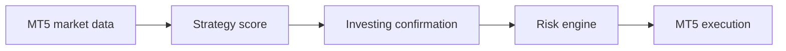
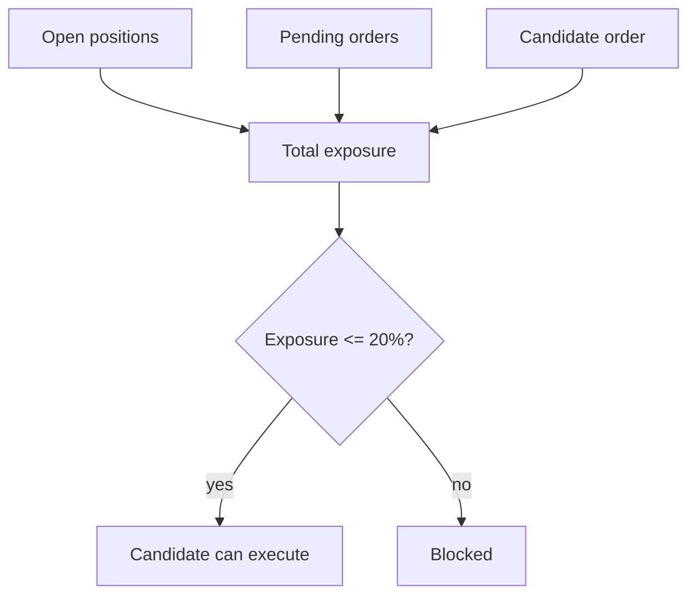

# How Strategy And Risk Work

This document explains how the app combines MT5 confluence, Investing.com confirmation, and risk controls before any trade is allowed.

## Decision Layers



Each layer can block the trade. A trade does not reach MT5 unless every layer passes.

## Layer 1: MT5 Strategy Score

The strategy reads candles and ticks from MT5 for each pair/timeframe.

Scored components:

| Component | Score |
| --- | ---: |
| EMA/MA trend alignment | `+24` |
| Price near SNR/Supply/Demand/Fib zone | `+18` |
| Trend pullback near EMA | `+16` |
| Quasimodo swing structure | `+12` |
| Fibonacci retracement zone active | `+14` |
| Confirmation candle | `+8` |

The score is capped at `100`.

Trade setup requires:

```text
score >= 60
side exists
orderType exists
entry, stopLoss, takeProfit exist
```

If the score is below `60`, the setup is blocked before risk execution.

## Layer 2: Investing.com Confirmation

Investing.com is not the main trade generator. It is an external confirmation filter.

The backend stores Investing timeframe signals:

| App timeframe | Investing timeframe |
| --- | --- |
| `M15` | `15m` |
| `M30` | `30m` |
| `H1` | `1h` |
| `H4` | `5h` |
| `D1` | `1d` |

Confirmation rules:

| Backend signal | Investing signal | Result |
| --- | --- | --- |
| `BUY` | `buy` / `strong_buy` / `neutral` | allowed to continue |
| `BUY` | `sell` / `strong_sell` | blocked |
| `SELL` | `sell` / `strong_sell` / `neutral` | allowed to continue |
| `SELL` | `buy` / `strong_buy` | blocked |
| any | sync not allowed | blocked |

Example:

```text
XAUUSD H1 backend signal = SELL
Investing 1h signal = strong_sell
Result = aligned, can continue to risk validation
```

Counter example:

```text
XAUUSD H1 backend signal = BUY
Investing 1h signal = strong_sell
Result = blocked, external confirmation conflicts
```

## Layer 3: Risk Engine

Risk is calculated from entry-to-stop distance:

```text
risk_usd = abs(entry - stopLoss) * contract_size * lot
risk_percent = risk_usd / equity * 100
```

Contract sizes:

| Pair | Contract size |
| --- | ---: |
| `XAUUSD` | `100` |
| `EURUSD` | `100000` |

Risk modes:

| Mode | Meaning |
| --- | --- |
| `fixed_lot` | User asks for a lot size; backend still caps volume |
| `fixed_usd` | User asks for fixed USD risk |
| `percent_equity` | User asks for percent of account equity |

Hard guards:

| Guard | Value |
| --- | --- |
| Max lot per position | `0.10` |
| Full Auto total risk cap | `20%` |
| Default risk value | `0.5%` equity |
| XAUUSD spread limit | `350 points` |
| EURUSD spread limit | `18 points` |

## Total Risk Cap

Full Auto checks total exposure before sending a new order.

Included in total exposure:

- Open positions.
- Pending orders.
- New candidate order.

If an existing open position or pending order has no stop loss, Full Auto is blocked because the backend cannot calculate maximum loss safely.



## Full Auto Execution Rules

Full Auto executes only when all of these are true:

1. Full Auto is ON.
2. Pair is enabled in Settings.
3. MT5 is connected.
4. MT5 trade permission is ready.
5. Demo guard allows the account.
6. Timeframe is `M15`, `M30`, or `H1`.
7. Score is at least `60`.
8. Investing.com timeframe signal does not conflict.
9. Spread is inside limit.
10. Entry, SL, and TP are valid.
11. Lot is valid and capped to `0.10`.
12. Total exposure after the candidate stays within `20%`.
13. Duplicate cooldown has not blocked the setup.

## Hard TP And Trailing

Hard TP is separate from the strategy signal and takes priority over trailing.

The Settings page stores separate USD thresholds for `XAUUSD` and `EURUSD`. Saved values persist in `data/strategy_settings.json` across backend and laptop restarts.

Behavior:

```text
if open position floating profit >= $10:
    backend sends an immediate market close request
```

The monitor runs every second while the backend is alive. It does not depend on frontend refresh and it does not require Full Auto to be enabled. Because market execution can slip during fast movement, the recorded result may differ slightly from exactly `$10`, but the app no longer intentionally trails a position back below the target.

Default trailing config:

| Pair | Trigger | Distance | Step | Pip size |
| --- | ---: | ---: | ---: | ---: |
| `XAUUSD` | `$10` | `150 pips` | `50 pips` | `0.01` |
| `EURUSD` | `$10` | `20 pips` | `8 pips` | `0.0001` |

The backend does not use native MT5 trailing. It polls positions, stores state per ticket, tracks peak price, and sends `SLTP` modify requests to MT5.

The UI reads `GET /api/auto-trailing/status` to show how many tickets are tracked, how many have active trailing, and which rules are currently used for each pair.

## Practical Reading Guide

When a trade is not opening, read blockers in this order:

1. Is Full Auto ON?
2. Is the pair enabled?
3. Is MT5 connected and trade ready?
4. Is the score at least `60`?
5. Does Investing.com conflict with the direction?
6. Is spread below the pair limit?
7. Does the trade have valid SL/TP?
8. Is total risk still under `20%`?
9. Is duplicate cooldown blocking?
